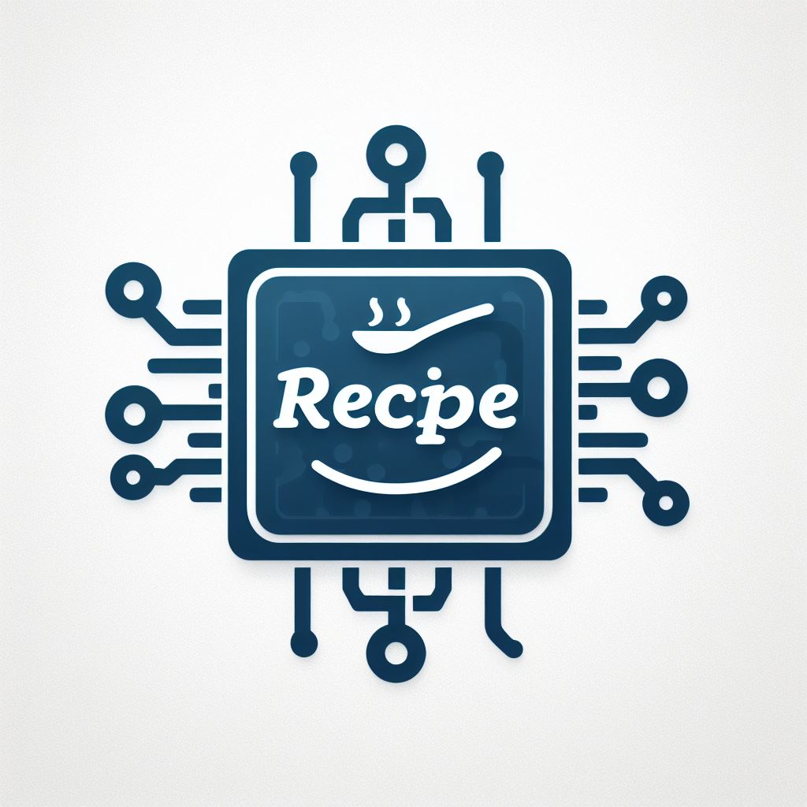

<div align="center">
 
  <br/>
  <h1><b>Recipe-App</b></h1>

</div>


<a name="readme-top"></a>

<!-- TABLE OF CONTENTS -->

# 📗 Table of Contents

- [📖 About the Project](#about-project)
  - [🛠 Built With](#built-with)
    - [Tech Stack](#tech-stack)
    - [Key Features](#key-features)
    - [🚀 Live Demo](#live-demo)
- [💻 Getting Started](#getting-started)
  - [Setup](#setup)
  - [Prerequisites](#prerequisites)
  - [Install](#install)
  - [Usage](#usage)
  - [Run tests](#run-tests)
  - [Deployment](#triangular_flag_on_post-deployment)
- [👥 Authors](#authors)
- [🔭 Future Features](#future-features)
- [🤝 Contributing](#contributing)
- [⭐️ Show your support](#support)
- [🙏 Acknowledgements](#acknowledgements)
- [🙏 Attribution](#attribution)
- [❓ FAQ](#faq)
- [📝 License](#license)


<!-- PROJECT DESCRIPTION -->

# 📖 [Recipe-App] <a name="about-project"></a>

Recipe-App is a Rails web application that allows users to add, update, and delete food items, create recipes and generate a shopping list. It is built using Ruby on Rails and PostgreSQL as the database, and it includes comprehensive unit and integration tests implemented with RSpec and Capybara.


## 🛠 Built With <a name="built-with"></a>

### Tech Stack <a name="tech-stack"></a>

<details>
<summary>Rails</summary>
  <ul>
    <li><a href="https://rubyonrails.org/">Rails</a></li>
  </ul>
</details>
<details>

<details>
<summary>Ruby</summary>
  <ul>
    <li><a href="https://www.ruby-lang.org/en/">Ruby</a></li>
  </ul>
</details>

<details>
<summary>Postgresql</summary>
  <ul>
    <li><a href="https://www.mysql.com/">PSQL</a></li>
  </ul>
</details>

<details>
<summary>RSpec</summary>
  <ul>
    <li><a href="https://www.mysql.com/">RSpec-Rails</a></li>
  </ul>
</details>

<details>
<summary>Capybara</summary>
  <ul>
    <li><a href="https://teamcapybara.github.io/capybara/">Capybara-Rails</a></li>
  </ul>
</details>

<details>
<summary>Rails CSS Bundler</summary>
  <ul>
    <li><a href="https://github.com/rails/cssbundling-rails">Rails CSS Bundler</a></li>
  </ul>
</details>

<details>
<summary>Cancan</summary>
  <ul>
    <li><a href="https://github.com/CanCanCommunity/cancancan">Cancan</a></li>
  </ul>
</details>

<details>
<summary>Devise</summary>
  <ul>
    <li><a href="https://github.com/heartcombo/devise">Devise</a></li>
  </ul>
</details>

<details>
<summary>Ruby Pg</summary>
  <ul>
    <li><a href="https://github.com/ged/ruby-pg">Ruby Pg</a></li>
  </ul>
</details>


<!-- Features -->

### Key Features <a name="key-features"></a>
> Data Model
> Validations
> Model Spec-Tests
> Controller Specs
> Create User
> Add Food Item
> Create Recipe
> View Lists: Food List | Recipe List | Shopping List


<p align="right">(<a href="#readme-top">back to top</a>)</p>

<!-- LIVE DEMO -->

## 🚀 Live Demo <a name="live-demo"></a>

> Live Demo of this application:

- [Live Demo Link](https://recipe-app-mier.onrender.com/)

<p align="right">(<a href="#readme-top">back to top</a>)</p>

<!-- GETTING STARTED -->

## 💻 Getting Started <a name="getting-started"></a>

To get a local copy up and running, follow these steps.

### Prerequisites

In order to run this project you need:

### Setup

Clone this repository to your desired folder:


```sh
  cd my-folder
  git clone https://github.com/RileyManda/recipe-app.git
```


### Install

Install this project with:

    ```sh
    cd my-project
    bundle install
    ```
    ```sh

### Usage

To run the project, you will need to execute:


```sh
  rails server
```


### Run tests

To run tests, run the following command:


```sh
  Rspec spec  or bundle exec rspec spec
```


<!-- ### Deployment

You can deploy this project using: -->

<!--
Example:

```sh

```
 -->

<p align="right">(<a href="#readme-top">back to top</a>)</p>

<!-- AUTHORS -->

## 👥 Authors <a name="authors"></a>

👤 **RileyManda**

- GitHub: [@RileyManda](https://github.com/RileyManda)
- Twitter: [@rilecodez](https://twitter.com/rileycodez)
- LinkedIn: [rileymanda](https://www.linkedin.com/in/rileymanda/)

👤 **Yusuf Sholotan**

- GitHub: [@yin-ka](https://github.com/yin-ka)
- LinkedIn: [Yusuf Sholotan](https://www.linkedin.com/in/yusuf-sholotan/)

<p align="right">(<a href="#readme-top">back to top</a>)</p>

<!-- FUTURE FEATURES -->

## 🔭 Future Features <a name="future-features"></a>


> Video Presentation> Deploy Application

<p align="right">(<a href="#readme-top">back to top</a>)</p>

<!-- CONTRIBUTING -->

## 🤝 Contributing <a name="contributing"></a>

Contributions, issues, and feature requests are welcome!

Feel free to check the [issues page](https://github.com/RileyManda/recipe-app/issues).

<p align="right">(<a href="#readme-top">back to top</a>)</p>

<!-- SUPPORT -->

<!-- SUPPORT -->
## <b>Show your support 🌟</b><a name="support"></a>

Thank you for taking the time to explore this project! Your support means a lot to me. If you find my project valuable and would like to contribute, here is one way you can support me:

 - <b>Star the project ⭐️</b>: Show your appreciation by starring this GitHub repository. It helps increase visibility and lets others know that the project is well-received.

 - <b>Fork the project 🍴 🎣</b>: If you're interested in making improvements or adding new features, feel free to fork the project. You can work on your own version and even submit pull requests to suggest changes.

 - <b>Share with others 🗺️</b>: Spread the word about this project. Share it on social media, mention it in relevant forums or communities, or recommend it to colleagues and friends who might find it useful.

<p align="right">(<a href="#readme-top">back to top</a>)</p>

<!-- ACKNOWLEDGEMENTS -->

## 🙏 Acknowledgments <a name="acknowledgements"></a>

I would like to express my sincere gratitude to [Microverse](https://github.com/microverseinc), the dedicated reviewers, and collaborators. Your unwavering support, feedback, and collaborative efforts have played an immense role in making this journey a resounding success. I am truly grateful for your contributions and for being an integral part of my achievements. Thank you for your continued support.

<p align="right">(<a href="#readme-top">back to top</a>)</p>

<!-- FAQ (optional) -->

## ❓ FAQ <a name="faq"></a>

- **Question_1**

  Do I have to use the vs code specifically?

  - Answer_1

    You can use any code editor of your choice. <br>


<p align="right">(<a href="#readme-top">back to top</a>)</p>

<!-- ATTRIBUTION -->
 ## 👥 Attribution <a name="attribution"></a>
- ProjectIcon: [Svgrepo](https://www.svgrepo.com/)

<!-- LICENSE -->

## 📝 License <a name="license"></a>

[MIT License](https://github.com/RileyManda/recipe-app/blob/dev/LICENSE)

<p align="right">(<a href="#readme-top">back to top</a>)</p>

